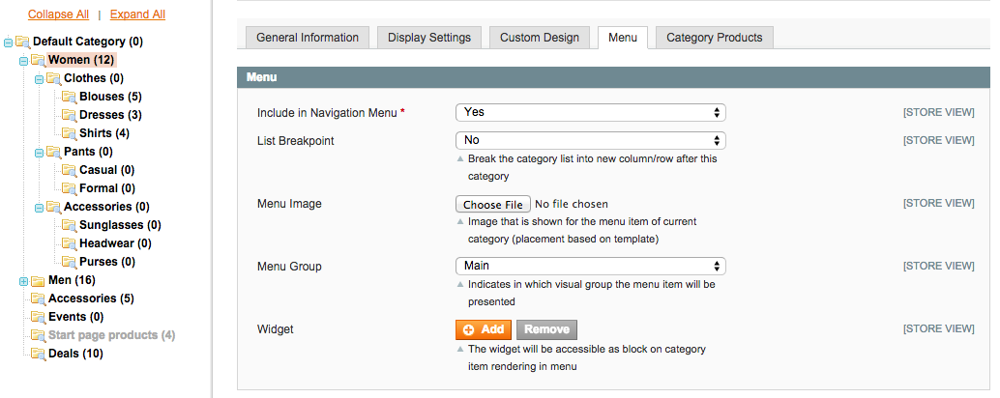

Usage
=====

More in-detail guide (with illustrations) on administration of the menu with vaimo/menu.

Switching To Another Menu Type
------------------------------

Some menu features are only available for certain menu types. Make sure that you select a type of menu that has the
support for the ones that are required.

For this guide, we are going to choose a menu type that has column support.

Note that after changing the menu type, the illustration of the menu behavior will appear to the right hand side of
the type configurator.

Menu Configuration For Each Menu Item
-------------------------------------

This is how a normal drop-down menu looks without any extra configuration

The menu construction is based on category tree which also means that the configuration that is applied on each
menu item can be managed from the same place where categories are configured - with the slight difference of
the navigation/menu configuration having it's own separate tab called "Menu".

Note that all **bold** items in the category tree indicate that the item is used in menu rendering.

Breakpoints
-----------

The menu configuration will allow the user to insert breakpoints even when a menu type is selected has actually
disallowed the support for them on the moment of rendering the menu. This guide assumes (including the images) that
menu type is set to:

.. code-block:: none

    Single level in drop-down (columns)

Basically the columns will work with any menu types that mention columns in their names or that indicate column-based
rendering in the type layout illustration.

The breakpoint setting is based on a simple notion that each menu item can declare to be the last item in the column
it belongs to. In this case, we'll mark category "Shirt" to be the last item in it's column.

After doing this, a breakpoint indicator will appear under specified category.

.. image:: images/breakpoints_4.png

The consequence of this configuration change can now be seen when the store front is reloaded.

Note that there is no limit on how many breakpoints one uses. So adding another one...

Will render the items in three columns

Groups (Footer)
---------------

Vaimo menu has a feature called "Menu Groups" that allows developers to define designated menu areas for certain menu
item block (for each level / item). The module comes with one such predefined group called "Footer"

Using it requires user to create a new on the level where the group is used and add sub-items under it.

After that we also need to tell Magento in what group / visual area this added item (and it's children) should be
rendered.

Note that the background color of the item that is rendered in an area other than "main" will have a distict color
that is generated from the Menu Group name that the item belongs to (This color will be automatically generated).

The consequence of this configuration change can now be seen when the store front is reloaded.

Nested Menu
-----------

Another menu type in the module allows items from multiple levels to be presented as lists with general header
item and sub-items that get listed under it.

This style of listing is triggered by changing the menu type in module configuration (or using the required
menu configuration in custom navigation block).

The menu structure required/expected by nested menu type has a distinct 3-level structure

Which will render on the store front in a way of having 3rd level embedded under 2nd level items

Note that breakpoints can also be used with nested menu type.

Resulting the nested items to be rendered into two columns.

Menu Widgets
------------

Menu widgets are based on CMS Widget Instance creation and relating the created instances with certain category
attributes.

As an example, a 3-column menu is used. Note that widgets are essentially supported by all menu types as long
as the template has been configured correctly.

To add a widget, the Widget configuration button 'Add' should be clicked after what a standard widget configuration
window will open.

After configuring the widget and confirming the configuration, the widget configuration controls will have
different caption that indicates the currently selected widget and it's state.

The widget will be created/linked when user **saves** the category configuration.

Note that defined widget will show as a child of the menu item it is configured on. The output is dependent on the
template where the widget output is called. By default it will only show if the menu item has sub-categories. The widget
output will only render only for main group items.

.. image:: images/widget_4.png

The configured widgets can also be accessed from normal Widget Instance grid.

Menu Images
-----------

Menu images are supported only by menu types that have the rendering of those images set as enabled.

Menu image can be configured by attaching an image file to Menu Image attribute and saving the category. Note
that in this example, columns are also used for desired layout to be achieved.

The consequence of this configuration change can now be seen when the store front is reloaded.

Menu Cache
----------

If menu cache automatic invalidation has been set to "No" in the module configuration the cache has to be
cleaned manually to make the category configuration changes to become visible on store front.

For widget configuration changes, layout cache reload might also be necessary.

